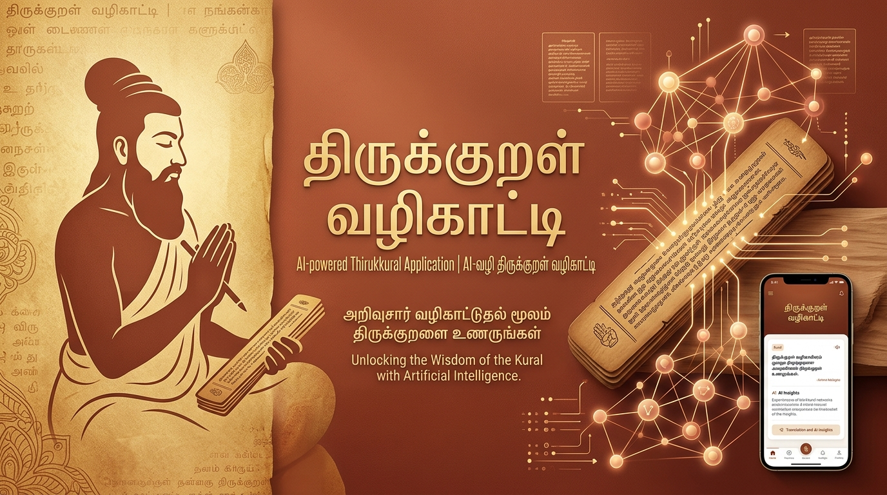
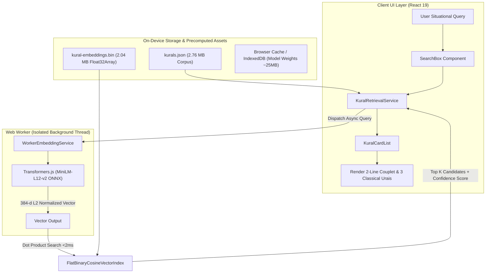

<div align="center">



# திருக்குறள் வழிகாட்டி (Thirukkural Situational Guide)
### 100% Offline, Privacy-First, On-Device AI Semantic Search for Thirukkural

[](https://react.dev/)
[](https://www.typescriptlang.org/)
[](https://vitejs.dev/)
[](https://huggingface.co/docs/transformers.js)
[](https://huggingface.co/Xenova/paraphrase-multilingual-MiniLM-L12-v2)
[](https://web.dev/progressive-web-apps/)
[](LICENSE)

</div>

---

## 📖 Overview

**திருக்குறள் வழிகாட்டி (Thirukkural Guide)** is a state-of-the-art, privacy-preserving semantic retrieval system that matches real-world situations, emotional dilemmas, and moral questions to relevant couplets from the **1,330 Thirukkurals**.

Instead of relying on rigid keyword search or remote cloud LLM APIs, this application performs **100% of its neural embedding generation and vector search directly inside the user's browser** using WebAssembly (WASM), WebGPU, and precomputed dense vector indices.

### Why This Matters:
- 🔒 **Zero Data Leakage**: Your thoughts, questions, and dilemmas never leave your device.
- ⚡ **Sub-Millisecond Inference**: Computes cosine similarity across all 1,330 vectors in **$< 2\text{ ms}$**.
- 📴 **100% Offline Capability**: Once the lightweight neural model (~25MB) is cached on the first visit, the entire app functions indefinitely without an active internet connection.
- 📚 **Comprehensive Classical Literature**: Every result includes the full classical couplet in traditional Tamil meter, 3 classical commentaries (*Mu. Varadarajan, Solomon Pappaiah, Kalaignar Karunanidhi*), and English translations/explanations.

---

## 🔗 Models & Open-Source Resources

This project is built upon open-source machine learning models and classical literary databases:

- **HuggingFace Embedding Model**: [`Xenova/paraphrase-multilingual-MiniLM-L12-v2`](https://huggingface.co/Xenova/paraphrase-multilingual-MiniLM-L12-v2) — 384-dimensional cross-lingual sentence embedding model quantized for in-browser execution.
- **In-Browser ML Runtime**: [Transformers.js (`@huggingface/transformers`)](https://github.com/huggingface/transformers.js) — Run state-of-the-art HuggingFace models directly in the browser with ONNX Runtime Web.
- **Thirukkural Dataset & Commentaries**: [Thirukkural JSON Database (`tk120404/thirukkural`)](https://github.com/tk120404/thirukkural) — Complete corpus of 1,330 Kurals with 3 classical Tamil commentaries (*மு. வரதராசனார், சாலமன் பாப்பையா, கலைஞர் மு. கருணாநிதி*) and English translations.
- **Vector Embeddings Framework**: [Sentence-Transformers (`UKPLab/sentence-transformers`)](https://github.com/UKPLab/sentence-transformers) — Used for precomputing offline binary dense vectors.

---

## 🏛️ Architecture & System Design

The project is built on **SOLID principles**, strict separation of concerns, and an **Abstraction / Interface Pattern** for Dependency Injection. The data sources, embedding models, vector indices, and UI components are completely decoupled.



---

## ✨ Key Features

1. **On-Device Neural Semantic Search**:
   - Embeds user queries using a quantized multilingual sentence transformer model ([`Xenova/paraphrase-multilingual-MiniLM-L12-v2`](https://huggingface.co/Xenova/paraphrase-multilingual-MiniLM-L12-v2)).
   - Cross-lingual semantic alignment supports **Tamil, English, and Tanglish** queries.

2. **Precomputed Dense Binary Vector Index**:
   - All 1,330 Kurals are pre-vectorized into a contiguous 384-dimensional binary buffer (`kural-embeddings.bin`, exactly `2,042,880` bytes).
   - In-browser cosine dot-product search executes in under **2 milliseconds**.

3. **Strict Classical 2-Line Couplet Typography**:
   - Character-aware dynamic CSS Container Queries (`cqi`) mathematically scale the font size so that **Line 1 (4 words)** and **Line 2 (3 words)** are guaranteed to fit on strictly two left-aligned lines with **zero overflow, zero wrapping, and zero horizontal scrolling** across all screen sizes (320px to 4K).

4. **3 Classical Tamil Commentaries + English Translation**:
   - **மு. வரதராசனார் உரை** (Mu. Varadarajan) — Primary commentary
   - **சாலமன் பாப்பையா உரை** (Solomon Pappaiah) — Accessible commentary
   - **கலைஞர் மு. கருணாநிதி உரை** (M. Karunanidhi) — Poetic prose commentary
   - Complete English translation and philosophical explanation.

5. **Audio Speech Synthesis**:
   - Integrated Web Speech API for Tamil voice recitation of couplets and commentaries.

6. **Progressive Web App (PWA)**:
   - Installable on iOS (Safari), Android (Chrome), and Desktop.
   - Workbox service worker precaches all assets for offline reliability.

---

## 🛠️ Technology Stack

| Domain | Technology | Version / Specification | Resource Link |
| :--- | :--- | :--- | :--- |
| **Frontend Framework** | React | `19.2.8` | [react.dev](https://react.dev/) |
| **Language** | TypeScript | `5.7+` | [typescriptlang.org](https://www.typescriptlang.org/) |
| **Build Tool & Dev Server** | Vite | `6.4+` | [vitejs.dev](https://vitejs.dev/) |
| **State Management** | Zustand | `5.0+` | [zustand-demo.pmnd.rs](https://zustand-demo.pmnd.rs/) |
| **Styling & Design System** | Tailwind CSS / Vanilla CSS | Tailwind CSS v4 | [tailwindcss.com](https://tailwindcss.com/) |
| **On-Device AI Engine** | Transformers.js (ONNX Runtime) | `@huggingface/transformers ^3.3.3` | [Transformers.js GitHub](https://github.com/huggingface/transformers.js) |
| **Embedding Model** | Multilingual MiniLM-L12-v2 | `Xenova/paraphrase-multilingual-MiniLM-L12-v2` | [HuggingFace Model Card](https://huggingface.co/Xenova/paraphrase-multilingual-MiniLM-L12-v2) |
| **Literature Dataset** | Thirukkural JSON Database | 1,330 Kurals with 3 Urais | [thirukkural GitHub Repo](https://github.com/tk120404/thirukkural) |
| **PWA & Offline** | Vite Plugin PWA (Workbox) | `vite-plugin-pwa ^0.21.2` | [vite-pwa-org](https://vite-pwa-org.netlify.app/) |
| **Icons & Audio** | Lucide React / Web Speech API | `lucide-react`, Native Browser SpeechSynthesis | [lucide.dev](https://lucide.dev/) |
| **Data Ingestion Pipeline** | Python / uv | Python 3.12, `sentence-transformers`, `numpy` | [Sentence-Transformers](https://github.com/UKPLab/sentence-transformers) |

---

## 🚀 Getting Started

### Prerequisites
- **Node.js**: `v18.0.0` or higher
- **npm** or **pnpm** or **yarn**
- *(Optional for data pipeline)*: **Python 3.10+** and **uv**

---

### Installation & Local Setup

1. **Clone the repository**:
   ```bash
   git clone https://github.com/Joker-Bat/thirukural-rag-offline.git
   cd thirukural-rag-offline
   ```

2. **Install frontend dependencies**:
   ```bash
   npm install
   ```

3. **Start the local development server**:
   ```bash
   npm run dev
   ```

4. **Open in your browser**:
   Navigate to [http://localhost:5173](http://localhost:5173).

---

### Production Build & Preview

To build the production-ready PWA bundle with optimized chunks:

```bash
# Type check and build bundle
npm run build

# Preview production build locally
npm run preview
```

---

## 🐍 Data Ingestion & Precomputed Embeddings Pipeline (Optional)

The precomputed embeddings (`public/kural-embeddings.bin`) and corpus (`public/kurals.json`) are already generated and committed. If you wish to re-generate them or change the embedding model:

1. Navigate to the project root.
2. Run the ingestion pipeline using `uv`:
   ```bash
   uv run python scripts/prepare-data.py
   ```
3. Run the automated semantic retrieval test suite:
   ```bash
   uv run python scripts/test-retrieval.py
   ```

---

## 📂 Project Structure

```text
thirukural-rag/
├── public/
│   ├── brand-banner.jpg          # Brand identity banner
│   ├── favicon.svg               # Classical terracotta logo
│   ├── kurals.json               # 1,330 Kurals with 3 commentaries & English
│   └── kural-embeddings.bin      # Precomputed 1330x384 Float32 binary dense index
├── scripts/
│   ├── prepare-data.py           # Ingestion & vector generation pipeline
│   └── test-retrieval.py         # Automated semantic benchmark tests
├── src/
│   ├── components/
│   │   ├── ui/                   # Reusable atomic UI components (Button, Badge, Card, Progress, Accordion)
│   │   ├── empty-fallback.tsx    # Low confidence / no results fallback
│   │   ├── header.tsx            # Sticky header with offline status pill
│   │   ├── kural-card.tsx        # Couplet cards with 2-line CQI fluid typography & commentaries
│   │   ├── model-download-modal.tsx # On-device model onboarding & live progress dialog
│   │   └── search-box.tsx        # Semantic search textarea & horizontal scroll situation presets
│   ├── context/
│   │   └── service-context.tsx   # React Dependency Injection provider
│   ├── services/
│   │   ├── interfaces/           # Core SOLID abstraction contracts
│   │   │   ├── data-source.interface.ts
│   │   │   ├── embedding-service.interface.ts
│   │   │   ├── retrieval-service.interface.ts
│   │   │   ├── speech-service.interface.ts
│   │   │   └── vector-index.interface.ts
│   │   ├── container.ts          # Dependency Injection service registry
│   │   ├── flat-binary-cosine-vector-index.ts # In-browser dot-product vector search
│   │   ├── kural-retrieval-service.ts         # Orchestrator for retrieval pipeline
│   │   ├── static-json-kural-data-source.ts   # Kural corpus loader
│   │   ├── web-speech-service.ts              # Tamil audio synthesis
│   │   └── worker-embedding-service.ts        # Web Worker communication manager
│   ├── stores/
│   │   └── use-kural-store.ts    # Zustand state store with LocalStorage persistence
│   ├── types/
│   │   ├── kural.ts              # Domain entities, commentary schemas, search types
│   │   └── worker-messages.ts    # Web Worker message protocols
│   ├── app.tsx                   # Main editorial app shell & layout
│   ├── index.css                 # Classical parchment design tokens & ambient gradients
│   ├── main.tsx                  # Application bootstrap & PWA registration
│   └── worker.ts                 # Transformers.js Web Worker feature extraction pipeline
├── package.json
├── tsconfig.json
├── vite.config.ts
└── README.md
```

---

## 📜 License

This project is open source and available under the [MIT License](LICENSE).

---

<div align="center">

**கற்க கசடறக் கற்பவை கற்றபின்**<br>
**நிற்க அதற்குத் தக.** (குறள் 391)

*Crafted with respect for Classical Tamil Literature & Modern Web Engineering.*

</div>
